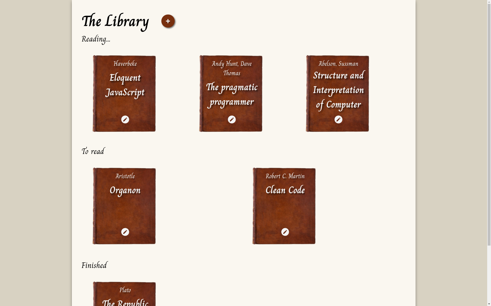

# The Library

A minimalistic web-based library manager for tracking reading progress. 

*This project is part of [The Odin Project](https://www.theodinproject.com/) JavaScript curriculum.*

**Live version:** 

## Features

- **Book Management**
  - Add new books with title, author, page count, and status
  - Edit existing book details
  - Delete books from collection
  - Organize by reading status (Reading/To Read/Finished)

- **Technical Showcase**
  - Event Delegation pattern implementation
  - Dynamic DOM manipulation
  - Object-oriented book representation

*Note: Data persists only during current session.*

## What I learned

This project helped solidify understanding of:
- DOM manipulation techniques
- Event handling patterns
- Modal dialog workflows
- Form validation strategies
- State management in vanilla JS
- Code organization principles

## Feedback

While this is primarily a learning exercise, suggestions are welcome!  
Please open an issue first to discuss proposed improvements